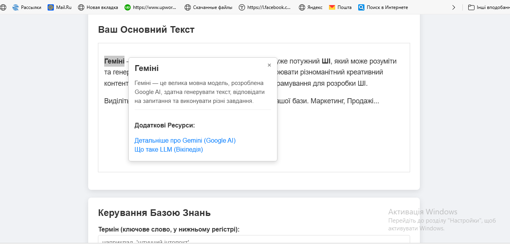

"# Space-pattern 

Space-pattern Створений: 12.06.2025р.
Цей проект "Space-pattern" є односторінковою веб-програмою (HTML/CSS/JavaScript в одному файлі HTML), розробленою для стимуляції користувача до активного пошуку інформації через представлення контекстно-залежного тексту.

Огляд
Основна ідея "Space-pattern" полягає у створенні динамічного інтерактивного досвіду, де текст адаптується або пропонує додаткові підказки на основі взаємодії користувача або певних умов. Це слугує інструментом для:

Розширення кругозору: Заохочує користувачів виходити за межі початкової інформації.
Навчання: Може бути використаний як інтерактивний навчальний посібник.
Дослідження: Надає підказки або запитання, які скеровують користувача до подальших досліджень.
Технології
## Демонстрація

Проект реалізовано за допомогою стандартних веб-технологій:

HTML: Структура сторінки та вміст.
CSS: Стилізація та візуальне оформлення.
JavaScript: Динамічна поведінка та контекстно-залежна логіка.
Весь код міститься в одному файлі index.html для простоти розгортання та перегляду.

Як використовувати (локально)
Щоб запустити цей проект на своєму комп'ютері:

Клонуйте репозиторій:
git clone https://github.com/boriskirp/Space-pattern.git
Перейдіть до каталогу проекту:
cd Space-pattern
Відкрийте файл index.html у вашому веб-браузері.
Внесок
Наразі проект розроблено як демонстрацію. Будь-які пропозиції щодо покращення або нові ідеї для контекстно-залежного тексту вітаються!

Ліцензія
Цей проект розповсюджується під Ліцензією MIT. Детальніше дивіться у файлі [LICENSE](LICENSE).
